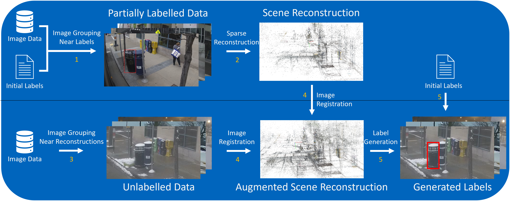

# Label Generation

This project allows to locate objects that have been labeled in domain in new domains and assign them the same label. Training with this additional automatically generated data can improve the performance of Deep Learning models in new domains.

This project was created during a research stay at the NavLab at Carnegie Mellon University in the scope of my Master's Thesis. 

Overview of the Reconstruction Pipeline (top) and Label Generation Pipeline
(bottom).
1. Partially labeled images are split into groups of images that are nearby a group of labels.
2. A sparse reconstruction is created for each group of labeled objects that helps to relocate
unlabeled nearby images.
3. Images from unlabeled data get grouped based on their proximity to a group of labels,
using the GPS data.
4. Using the sparse reconstructions created in step 2. and the grouped images corresponding
to the sparse reconstructions, the 3D positions of feature points of the unlabeled
images are determined.
5. Using the 3D positions of feature points inside the given labels and their corresponding
position in the unlabeled images, new labels are generated.

## How to use

1. Open a terminal in the data folder
2. Download the labels from [kaggle](https://www.kaggle.com/datasets/elirotondo/waste-bin-detection-dataset-riss-2021). For static trash can labels, download the respective json files from [this dataset](https://www.kaggle.com/datasets/3650f5a2004c51d9dc1833c7a4075951729c75e464eca0cc7253970cd15c8524) and copy them into the sunny and cloudy folder of the first dataset.
3. Download bags from labelled run (2021_03_23_14_33) with 5Hz frequency from Colossus
4. Use `python read_bag_near_labels.py -f 2021_03_23_14_33 -o label_reconstructions35 -l "Waste_Bin_Detection_Dataset/sunny_2021_03_23_14_33_cam5_filtered (training dataset images and ground truths)/sunny_2021_03_23_14_33_cam5_filtered_detection_ground_truth_labels(training dataset).json" -g -s -c 3 5` to extract all relevant images from the bags 
5. Run `./reconstruct.sh` to create sparse reconstructions for all locations with labels
6. Download a new bag file or folder of bag files that should be matched with the existing labels, e.g. bus_2021-03-23-07-07-07_6.bag
7. Run `python read_bag_near_reconstructions.py -i ../data/bag_data/<data_name>.bag -o "../data/unsupervised-data/<output_data_name>/" -v 1 -g -s -c 3 5` . Setting v > 0 ignores images while not moving, i.e. 
8. Add the path to the data to the DATA_PATH variable, e.g. by calling `export DATA_PATH="../data"`
9. (Option 1) If using git bash on windows: add the paths to the colmap installation in the git bash shell, e.g. call `export PATH=$PATH:<...>/COLMAP-3.7-windows-cuda/:<...>/COLMAP-3.7-windows-cuda/lib`
9. (Option 2) Run `nano ~/.bashrc`, and paste `alias colmap='function __colmap() { cmd.exe /c "colmap $(printf "%q " "$@")"; }; __colmap'` into the file. Exit by pressenig `Ctrl+X`, then `y` and `Enter`. Source the script for each terminal by running `source ~/.bashrc`
11. Run `./localize_new_images.sh <data_path> <output_data_name> <max-num-images>` to match the new images with the reconstructions of the labelled data, e.g. `./localize_new_images.sh ../data bus_2021-03-23-07-07-07_6 200`
12. Run `cd ../BoxGeneration`
13. Run `python box_generator.py -p ../data/ -d <output_data_name>` to generate labels, which will be stored in `../outputs/<output_data_name>/`. Visualizations of the labels can be generated by adding the -v flag and will be stored in the folder `../outputs/viz/<output_data_name>/`

## Acknowledgements
I want to thank Navlab, the CMU Robotics Institute, and Dr. Christoph Mertz for hosting me for several months to do my research for this project. They generously provided me with the large BusEdge dataset. BusEdge is a project sponsored by the Mobility21 University Transportation Center (https://mobility21.cmu.edu/).

I further want to thank the DAAD for their generous scholarship.
